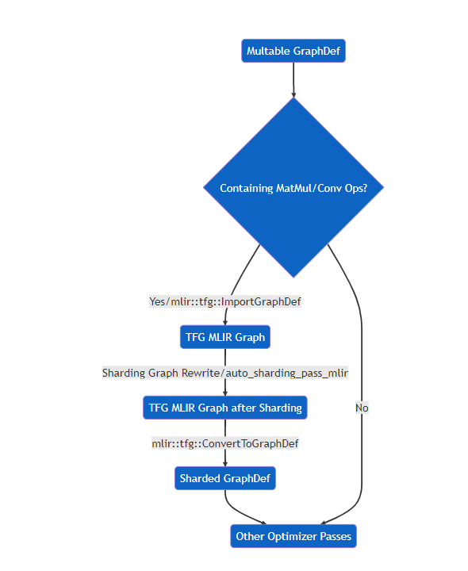

# XPUAutoShard on GPU [Experimental]

## Overview
Given a set of XPU devices (e.g., 2 GPU tiles), XPUAutoShard automatically shards the input data and the TensorFlow graph, placing these data/graph shards on GPU devices to maximize the hardware usage. 

Currently, it only supports data split on the batch dimension. As the first release of the feature, the functionality and the performance commitment are limited to the homogeneous GPU devices.

## Workflow 
At the high level, XPUAutoShard is added as a grappler pass of Intel® Extension for TensorFlow*. It accepts a TFG MLIR graph converted from the TensorFlow Graph. It is assumed here that the TensorFlow Graph here containing MatMul or Conv OP is the main part of the model, which can be converted to MLIR module normally, and then AutoShard can be performed, otherwise, it will return directly. The sharding graph rewrite is implemented as MLIR passes and the resulting sharded graph is also a TFG MLIR graph. After the graph is sharded, the TFG MLIR graph is converted back to TensorFlow Graph which is then passed to other graph optimization passes in Intel® Extension for TensorFlow* like graph fusion.

 

## Code Structure
Source codes are under `itex/core/experimental/XPUAutoShard/include` and `itex/core/experimental/XPUAutoShard/src`.

The primary source files are under [src/xpuautoshard/tensorflow](../../itex/core/experimental/XPUAutoShard/src/xpuautoshard/tensorflow) and [src/xpuautoshard/common](../../itex/core/experimental/XPUAutoShard/src/xpuautoshard/common). 

[interface_mlir.cpp](../../itex/core/experimental/XPUAutoShard/src/xpuautoshard/tensorflow/interface_mlir.cpp) contains the entry point of XPUAutoShard: `auto_sharding_pass_mlir` and can be invoked in [tfg_optimizer_hook.cc](../../itex/core/graph/tfg_optimizer_hook/tfg_optimizer_hook.cc), which contains conversion between TFG and Graphdef and as a hook to implement the graph optimizer pass in TFG dialect, then the AutoShard graph optimizer pass is added in [xpu_optimizer.cc](../../itex/core/graph/xpu_optimizer.cc).

The MLIR passes are under [src/xpuautoshard/tensorflow/passes](../../itex/core/experimental/XPUAutoShard/src/xpuautoshard/tensorflow/passes) and [src/xpuautoshard/common/mlir/passes](../../itex/core/experimental/XPUAutoShard/src/xpuautoshard/common/mlir/passes), which are composed of the following graph rewrite steps:

`type_inference.cpp` -> `tfg_to_hs.cpp` -> `auto_sharding_pass.cpp` -> `hs_to_tfg.cpp`

* `type_inference` adds the shape info to the graph. 
* `tfg_to_hs` marks the graph scopes that can be sharded with shard/unshard ops and also annotates the graph values with uninitialized "sharding properties". <br> Note that `hs` is the namespace of HS-IR, which represents Heterogeneous Sharding.
* `auto_sharding_pass` initializes the sharding properties with the decision how to shard the marked data and place the data on devices. This is the key component of XPUAutoShard. The pass relies on the heuristics at [heuristics_initializer.cpp](../../itex/core/experimental/XPUAutoShard/src/xpuautoshard/common/mlir/passes/heuristics_initializer.cpp) and the [hsp_inference](../../itex/core/experimental/XPUAutoShard/src/xpuautoshard/common/hsp_inference) to infer the sharding properties per TensorFlow op semantics. `auto_sharding_pass` also contains propagation sharding properties, the pass of which is mainly at [mlir_hsp_annotator.cpp](../../itex/core/experimental/XPUAutoShard/src/xpuautoshard/common/mlir/passes/mlir_hsp_annotator.cpp).
* `hs_to_tfg` finally shards the graph according to the sharding properties.


## Usage

### Python API
XPUAutoShard can be enabled via Python API. The feature is turned on with `itex.GraphOptions` via `sharding=itex.ON` flag. A global configuration `ShardingConfig` is provided to set the devices and how the sharding is applied. When the auto sharding mode `config.auto_mode` is set to `False`, parameters `batch_size` and `stage_num` are needed to decide how the sharding is applied, otherwise, these parameters are automatically decided by XPUAutoShard. Current release doesn't target auto mode.

```python
import intel_extension_for_tensorflow as itex
config = itex.ShardingConfig()
config.auto_mode = False
device_gpu = config.devices.add()
device_gpu.device_type = "gpu"
device_gpu.device_num = 2
device_gpu.batch_size = 64
device_gpu.stage_num = 2
graph_opts = itex.GraphOptions(sharding=itex.ON, sharding_config=config)
itex_cfg = itex.ConfigProto(graph_options=graph_opts)
itex.set_config(itex_cfg)
# model construction and execution follow...
...
```

### Dump the graph
You can dump the graph via setting `export ITEX_VERBOSE=4` and then `itex_optimizer_before_sharding.pbtxt` and `itex_optimizer_after_sharding.pbtxt` will be saved under current directory.

### Examples
Please refer to [ResNet50 training example with XPUAutoShard](../../examples/train_resnet50_with_autoshard/README.md) for details.
